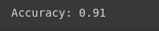

# Implementation-of-Logistic-Regression-Model-to-Predict-the-Placement-Status-of-Student

## AIM:
To write a program to implement the the Logistic Regression Model to Predict the Placement Status of Student.

## Equipments Required:
1. Hardware – PCs
2. Anaconda – Python 3.7 Installation / Jupyter notebook

## Algorithm
1. Import the necessary libraries.
2. Drop the unnecessary columns.
3. Generate the cat codes.
4. Identify dependant and independent variables.
5. Split the data into training and testing data.
6. Implement Logistic Regression and train the model.
7. Predict whether the student would get placed or not using the model.

## Program:
```python
/*
Program to implement the the Logistic Regression Model to Predict the Placement Status of Student.
Developed by   :  Sam Israel D
RegisterNumber :  212222230128
*/
```
### Import necessary libraries.
```python
import pandas as pd
import numpy as np
import matplotlib.pyplot as plt
```
### Read the CSV file and print the necessary information.
```python
df = pd.read_csv("Placement_Data_Full_Class.csv")

print(df.head())
print(df.info())
print(df.describe())
```
### Drop unnecessary fields.
```python
df = df.drop('sl_no', axis=1)
df = df.drop(['ssc_b','hsc_b','gender'],axis=1)
```
### Convert to category datatype
```python
df['degree_t'] = df['degree_t'].astype('category')
df['workex'] = df['workex'].astype('category')
df['specialisation'] = df['specialisation'].astype('category')
df['status'] = df['status'].astype('category')
df['hsc_s'] = df['hsc_s'].astype('category')
```
### Assign numerical codes to the categories
```python
df['degree_t'] = df['degree_t'].cat.codes
df['workex'] = df['workex'].cat.codes
df['specialisation'] = df['specialisation'].cat.codes
df['status'] = df['status'].cat.codes
df['hsc_s'] = df['hsc_s'].cat.codes
```
### Select the features and labels
```python
X = df.iloc[:,:-1].values
Y = df.iloc[:,-1].values
```
### Print X and Y's shape
```python
print(X.shape,'\n',Y.shape)
```
### Divide the data into train and test
```python
from sklearn.model_selection import train_test_split
X_train, X_test, Y_train, Y_test = train_test_split(X,Y,test_size=0.2)

# display dataset
df.head()
```
```python
print(df['status'])
```
### Print duplicated data
```python
df.duplicated()
```
### Creating a classifier using sklearn
```python
from sklearn.linear_model import LogisticRegression

clf = LogisticRegression(solver="liblinear")
clf.fit(X_train,Y_train)
y_pred = clf.predict(X_test)
y_pred
```
### Calculate the accuracy score
```python
from sklearn.metrics import accuracy_score
accuracy = accuracy_score(y_test,y_pred)
accuracy
```
### Print the confusion matrix
```python
from sklearn.metrics import confusion_matrix
confusion = (y_test,y_pred)
confusion
```
### Classification report
```python
from sklearn.metrics import classification_report
classification_report1 = classification_report(y_test,y_pred)
print(classification_report1)
```
### Prediction
```python
if(list(clf.predict([[0,87,0,95,0,2,0,0,2]]))[0] == 1):
    print("Will get placed")
else:
    print("Won't get placed")
```

## Output:

### Placement data

### Salary data

### Checking the null function()

### Data duplicate

### Print data

### Data status

### y_prediction Array

### Accuracy value

### Confusion matrix

### Classification report

### Prediction of LR


## Result:
Thus the program to implement the the Logistic Regression Model to Predict the Placement Status of Student is written and verified using python programming.
